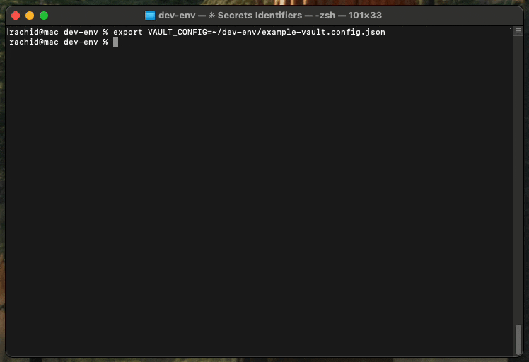

[](https://github.com/RachidChabane/mcp-secrets-vault/actions/workflows/ci.yml) [](https://codecov.io/gh/RachidChabane/mcp-secrets-vault) [](https://www.npmjs.com/package/mcp-secrets-vault) [](https://opensource.org/licenses/MIT)

# MCP Secrets Vault

A secure Model Context Protocol (MCP) server that enables AI assistants to use secrets (API keys, tokens) without ever exposing them. Built with TypeScript, featuring policy-based access control, rate limiting, and comprehensive audit logging.



[📺 View Full Demo Guide](./DEMO.md)

## 🔒 Security First

**Key Security Guarantee**: AI assistants can use your secrets to perform actions but will NEVER see the actual secret values.

- Secrets are stored only in environment variables
- All outputs are sanitized before returning to the AI
- Every action is logged for audit compliance
- Deny-by-default policy enforcement
- Rate limiting prevents abuse

## 🚀 Quick Start

### Installation

#### Option 1: Global Installation
```bash
npm install -g mcp-secrets-vault
mcp-secrets-vault doctor  # Verify installation
```

#### Option 2: Direct Usage with npx (Recommended)
```bash
npx mcp-secrets-vault doctor  # Test without installing
```

#### Option 3: Local Installation in Project
```bash
npm install mcp-secrets-vault
```

### MCP Client Configuration

For use with Claude Desktop or other MCP clients:

```json
{
  "mcpServers": {
    "secrets-vault": {
      "command": "npx",
      "args": ["mcp-secrets-vault"],
      "env": {
        "VAULT_CONFIG": "./vault.config.json"
      }
    }
  }
}
```

### Basic Setup

1. **Set your environment variables**:
```bash
export GITHUB_TOKEN="ghp_example123fake456token"
export OPENAI_API_KEY="sk-fake789example012key"
```

2. **Create a configuration file** (`vault.config.json`):
```json
{
  "secrets": [
    {
      "secretId": "github_api",
      "envVar": "GITHUB_TOKEN",
      "description": "GitHub API access"
    },
    {
      "secretId": "openai_key",
      "envVar": "OPENAI_API_KEY",
      "description": "OpenAI API access"
    }
  ],
  "policies": [
    {
      "secretId": "github_api",
      "allowedActions": ["http_get", "http_post"],
      "allowedDomains": ["api.github.com"],
      "rateLimit": {
        "requests": 100,
        "windowSeconds": 3600
      }
    },
    {
      "secretId": "openai_key",
      "allowedActions": ["http_post"],
      "allowedDomains": ["api.openai.com"],
      "rateLimit": {
        "requests": 50,
        "windowSeconds": 3600
      }
    }
  ]
}
```

### Quick Start with Auto-Discovery

**NEW**: Quickly initialize your configuration by auto-discovering secrets from environment variables!

1. **Set your environment variables**:
```bash
export GITHUB_TOKEN="ghp_example123"
export OPENAI_API_KEY="sk-example456"
export STRIPE_SECRET_KEY="sk_test_example789"
```

2. **Auto-generate configuration**:
```bash
npx mcp-secrets-vault --init --discover-env "GITHUB_*,OPENAI_*,STRIPE_*"
```

This will create a `vault.config.json` with discovered secrets. You'll still need to add allowed domains to the policies before use.

3. **Review and edit** the generated `vault.config.json`:
   - Add allowed domains for each secret
   - Adjust rate limits as needed
   - Remove any secrets you don't want to expose

4. **Verify your setup**:
```bash
npx mcp-secrets-vault doctor
```

### Environment-Specific .env Files

**NEW**: Support for environment-specific .env files (like Vite/Create React App)!

The server automatically loads .env files in this precedence order:
1. `.env.{environment}.local` (highest priority, gitignored)
2. `.env.{environment}` (e.g., `.env.development`)
3. `.env.local` (gitignored)
4. `.env` (lowest priority)

Where `{environment}` is determined by `NODE_ENV` or `MCP_ENV`.

**Example setup:**

```bash
# .env.development
GITHUB_TOKEN=ghp_dev_token_12345
OPENAI_API_KEY=sk-dev-key-67890

# .env.production
GITHUB_TOKEN=ghp_prod_token_real
OPENAI_API_KEY=sk-prod-key-real
```

**Security Notes:**
- ⚠️ **ALL .env files should be gitignored** - they contain secrets!
- `.env.*.local` files are for local overrides only
- Existing environment variables take precedence over .env files
- The vault.config.json still controls policies (env files only provide values)

## 📖 Architecture

### System Overview

```
┌─────────────────────────────────────────────────────┐
│                   MCP Client (AI)                   │
│                                                     │
│  ┌─────────┐ ┌──────────┐ ┌─────────┐ ┌──────────┐  │
│  │Discover │ │ Describe │ │   Use   │ │  Query   │  │
│  │ Secrets │ │  Policy  │ │ Secret  │ │  Audit   │  │
│  └────┬────┘ └────┬─────┘ └────┬────┘ └────┬─────┘  │
└───────┼───────────┼────────────┼───────────┼────────┘
        │           │            │           │
        ▼           ▼            ▼           ▼
┌─────────────────────────────────────────────────────┐
│               MCP Secrets Vault Server              │
│                                                     │
│  ┌──────────────────────────────────────────────┐   │
│  │            Policy Evaluation Engine          │   │
│  │         (Exact FQDN matching only)           │   │
│  └──────────────────────────────────────────────┘   │
│                                                     │
│  ┌──────────────────────────────────────────────┐   │
│  │           Rate Limiter (Token Bucket)        │   │
│  └──────────────────────────────────────────────┘   │
│                                                     │
│  ┌──────────────────────────────────────────────┐   │
│  │        Secret Provider (ENV mapping)         │   │
│  └──────────────────────────────────────────────┘   │
│                                                     │
│  ┌──────────────────────────────────────────────┐   │
│  │      Action Executor (HTTP GET/POST)         │   │
│  └──────────────────────────────────────────────┘   │
│                                                     │
│  ┌──────────────────────────────────────────────┐   │
│  │         Audit Logger (JSONL format)          │   │
│  └──────────────────────────────────────────────┘   │
└─────────────────────────────────────────────────────┘
        ▲                                    │
        │                                    ▼
┌───────────────┐                   ┌─────────────────┐
│ Environment   │                   │   Audit Files   │
│   Variables   │                   │    (JSONL)      │
└───────────────┘                   └─────────────────┘
```

### Core Components

- **Policy Engine**: Validates every request against strict allowlists (no wildcards)
- **Rate Limiter**: Token bucket algorithm with per-secret limits
- **Secret Provider**: Maps secret IDs to environment variables (never exposes values)
- **Action Executor**: Performs HTTP requests with injected secrets
- **Audit Logger**: Comprehensive JSONL audit trail for compliance

## 🛡️ Security Model

### Multi-Layer Protection

1. **Input Boundary**: All inputs validated with Zod schemas
2. **Policy Layer**: Explicit allowlists only (deny by default)
3. **Execution Layer**: Secrets injected only at execution time
4. **Output Boundary**: All responses sanitized before return

### Security Guarantees

- ✅ Secret values NEVER appear in MCP responses
- ✅ Secret values NEVER appear in error messages
- ✅ Secret values NEVER appear in logs
- ✅ Secret values NEVER appear in audit records
- ✅ Every action attempt is audited (success or failure)
- ✅ Rate limiting prevents abuse
- ✅ Exact domain matching only (no wildcards)

## 📋 Policy Configuration

### Policy Structure

```json
{
  "secretId": "api_key_identifier",
  "allowedActions": ["http_get", "http_post"],
  "allowedDomains": ["api.example.com"],
  "rateLimit": {
    "requests": 100,
    "windowSeconds": 3600
  },
  "expiresAt": "2024-12-31T23:59:59Z"
}
```

### Supported Actions

- `http_get`: HTTP GET requests
- `http_post`: HTTP POST requests

### Important Notes

- Domains must be exact FQDNs (no wildcards or patterns)
- All policies are deny-by-default
- Rate limits use token bucket algorithm
- Policies are validated on startup

## 🔍 Available MCP Tools

### 1. discover_secrets
Lists all available secrets (IDs only, never values).

**Response Example**:
```json
{
  "secrets": [
    {
      "secretId": "github_api",
      "description": "GitHub API access",
      "hasPolicy": true
    }
  ]
}
```

### 2. describe_policy
Returns the policy for a specific secret.

**Request**:
```json
{
  "secretId": "github_api"
}
```

**Response**:
```json
{
  "secretId": "github_api",
  "allowedActions": ["http_get", "http_post"],
  "allowedDomains": ["api.github.com"],
  "rateLimit": {
    "requests": 100,
    "windowSeconds": 3600
  }
}
```

### 3. use_secret
Execute an action using a secret (without exposing it).

**Request**:
```json
{
  "secretId": "github_api",
  "action": "http_get",
  "url": "https://api.github.com/user/repos",
  "options": {
    "headers": {
      "Accept": "application/vnd.github.v3+json"
    }
  }
}
```

**Response** (sanitized):
```json
{
  "success": true,
  "statusCode": 200,
  "summary": "Retrieved 15 repositories",
  "headers": {
    "content-type": "application/json"
  }
}
```

### 4. query_audit
Query the audit log for usage history.

**Request**:
```json
{
  "secretId": "github_api",
  "startTime": "2024-01-01T00:00:00Z",
  "limit": 10
}
```

## 📝 Audit Logging

All actions are logged in JSONL format for compliance:

```json
{"timestamp":"2024-01-15T10:30:00Z","secretId":"github_api","action":"http_get","domain":"api.github.com","outcome":"allowed","statusCode":200}
{"timestamp":"2024-01-15T10:31:00Z","secretId":"openai_key","action":"http_post","domain":"api.openai.com","outcome":"rate_limited","reason":"Exceeded 50 requests per hour"}
```

## 🔧 Configuration

### Environment Variables

- `VAULT_CONFIG`: Path to configuration file (default: `./vault.config.json`)
- `VAULT_LOG_LEVEL`: Logging level (ERROR, WARN, INFO, DEBUG)
- `VAULT_AUDIT_DIR`: Directory for audit logs (default: `./audit`)

### Configuration Schema

See [config.schema.json](./config.schema.json) for the complete JSON schema.

## 🧪 Development

### Prerequisites

- Node.js 20+ (LTS)
- npm or yarn

### Setup

```bash
# Clone the repository
git clone https://github.com/RachidChabane/mcp-secrets-vault
cd mcp-secrets-vault

# Install dependencies
npm install

# Run tests
npm test

# Build the project
npm run build

# Run in development mode
npm run dev
```

### Testing

```bash
# Run tests with coverage
npm run test:coverage

# Run specific test
npx vitest run src/services/rate-limiter.test.ts

# Type checking
npm run typecheck
```

### CI/CD

This project uses GitHub Actions for continuous integration. The CI pipeline:

- **Triggers**: Runs on push to `develop`, `main`, and feature branches (`feat/**`, `fix/**`, `hotfix/**`, `release/**`), and on pull requests targeting `develop`
- **Coverage Requirement**: Enforces ≥80% test coverage threshold - builds will fail if coverage drops below this level
- **Build Artifacts**: Coverage reports are uploaded and retained for 7 days
- **Branch Protection**: The `build-and-test` check must pass before merging to `develop` or `main`

The CI workflow ensures code quality and test coverage standards are maintained across all contributions.

## 🤝 Contributing

We welcome contributions! Please follow these guidelines:

1. Fork the repository
2. Create a feature branch (`feat/your-feature`)
3. Write tests (maintain ≥80% coverage)
4. Use the provided text constants
5. Commit with emoji prefixes (`:sparkles: [task-XX] Add feature`)
6. Open a PR to `develop` branch

### Code Standards

- TypeScript strict mode
- 80%+ test coverage
- All strings in constants files
- Comprehensive error handling

## 📄 License

MIT License - see [LICENSE](./LICENSE) file for details.

## 🔗 Links

- [GitHub Repository](https://github.com/RachidChabane/mcp-secrets-vault)
- [MCP Protocol Documentation](https://modelcontextprotocol.io)
- [Issue Tracker](https://github.com/RachidChabane/mcp-secrets-vault/issues)

## 🔭 Roadmap (post-MVP, non-binding)

- **Init wizard + templates**: scaffold a minimal `vault.config.json`.
- **Dry-run mode**: simulate requests and show effective headers (secrets masked).
- **CLI audit viewer**: list/filter/export JSONL by date/id/FQDN with simple pagination.
- **Refined rate limits**: per-FQDN and per-secret; deterministic retry/backoff.
- **Consent gate & response guards**: first-use confirmation per domain; max body size & per-domain timeouts.

## ⚠️ Disclaimer

This tool is designed for development and controlled environments. Always follow your organization's security policies when handling sensitive credentials.